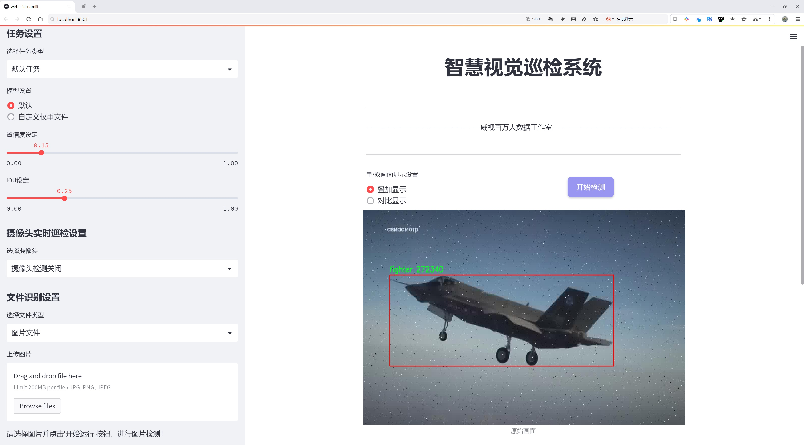
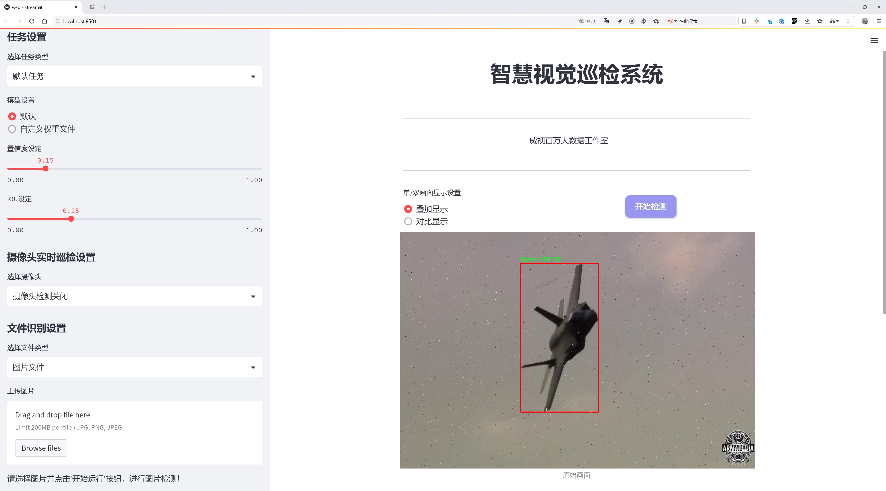
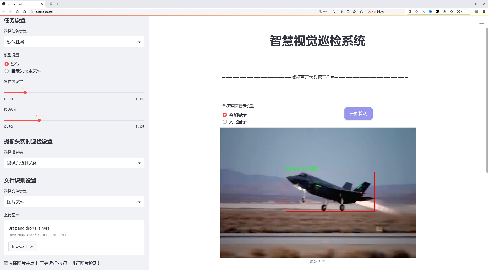
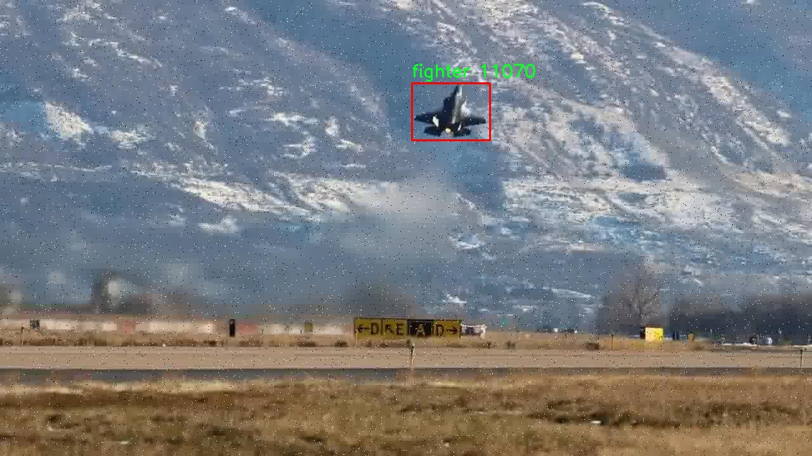
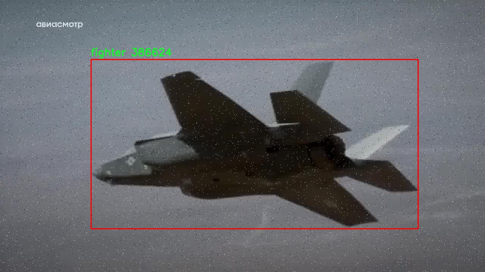
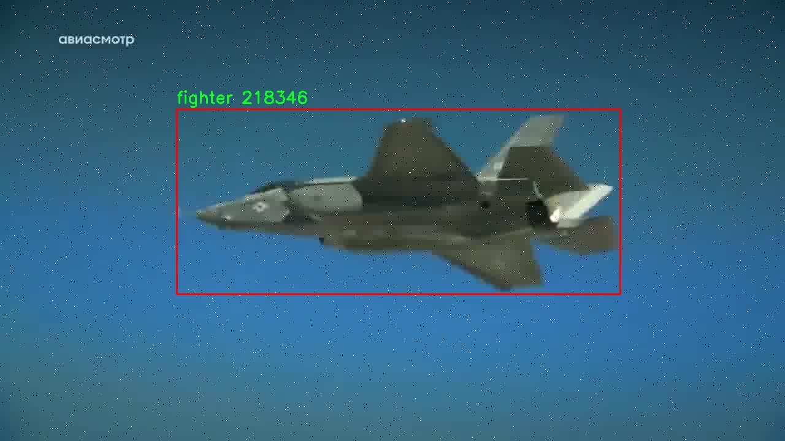
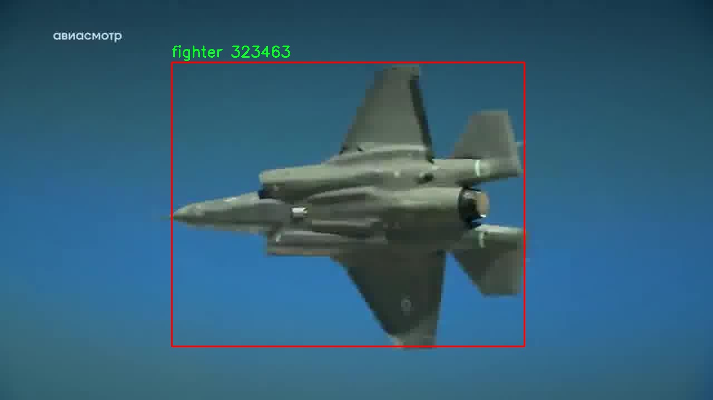
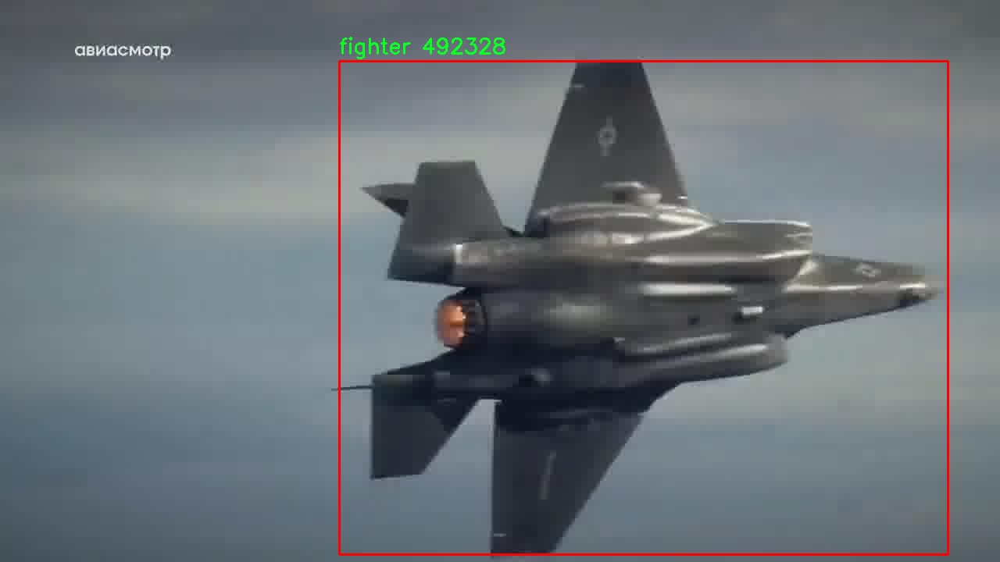

# 战斗机检测检测系统源码分享
 # [一条龙教学YOLOV8标注好的数据集一键训练_70+全套改进创新点发刊_Web前端展示]

### 1.研究背景与意义

项目参考[AAAI Association for the Advancement of Artificial Intelligence](https://gitee.com/qunshansj/projects)

项目来源[AACV Association for the Advancement of Computer Vision](https://gitee.com/qunmasj/projects)

研究背景与意义

随着现代战争的不断演变，空中作战的地位愈发重要，战斗机作为空中力量的核心，承担着制空权争夺、对地打击等多重任务。因此，快速、准确地检测和识别战斗机在军事侦察、战场监控以及指挥决策中具有重要意义。传统的战斗机检测方法往往依赖于人工观察和简单的图像处理技术，存在着效率低、准确性差等问题。随着深度学习技术的迅猛发展，基于卷积神经网络（CNN）的目标检测算法逐渐成为研究热点，其中YOLO（You Only Look Once）系列算法因其高效性和实时性被广泛应用于目标检测领域。

YOLOv8作为YOLO系列的最新版本，进一步提升了目标检测的精度和速度。然而，针对特定场景，如战斗机检测，YOLOv8的性能仍有待提升。为了实现更高效的战斗机检测系统，本研究基于改进YOLOv8算法，结合特定的数据集进行优化，旨在提高战斗机的检测准确率和实时性。

本研究所使用的数据集包含5800张战斗机图像，且类别数量为1，专注于战斗机这一特定目标。这一数据集的构建不仅为算法的训练提供了丰富的样本，也为后续的模型评估和验证奠定了基础。通过对数据集的深入分析，可以发现战斗机在不同场景、不同光照条件下的外观特征和变化，这为模型的训练提供了多样性和复杂性，有助于提高模型的泛化能力。

改进YOLOv8的战斗机检测系统的研究意义在于，不仅可以为军事领域提供高效的战斗机监测手段，还能够为其他领域的目标检测提供借鉴。通过引入改进的算法架构和训练策略，可以有效提升模型在复杂环境下的检测性能，降低误检率和漏检率。此外，研究成果还可以为无人机、卫星图像分析等相关应用提供技术支持，推动相关领域的智能化发展。

综上所述，基于改进YOLOv8的战斗机检测系统的研究，不仅具有重要的理论价值，还具备广泛的应用前景。通过本研究的深入开展，期望能够为战斗机的快速识别和监测提供一种新的解决方案，助力现代战争中空中力量的有效运用，同时推动目标检测技术的不断进步与创新。

### 2.图片演示







##### 注意：由于此博客编辑较早，上面“2.图片演示”和“3.视频演示”展示的系统图片或者视频可能为老版本，新版本在老版本的基础上升级如下：（实际效果以升级的新版本为准）

  （1）适配了YOLOV8的“目标检测”模型和“实例分割”模型，通过加载相应的权重（.pt）文件即可自适应加载模型。

  （2）支持“图片识别”、“视频识别”、“摄像头实时识别”三种识别模式。

  （3）支持“图片识别”、“视频识别”、“摄像头实时识别”三种识别结果保存导出，解决手动导出（容易卡顿出现爆内存）存在的问题，识别完自动保存结果并导出到tempDir中。

  （4）支持Web前端系统中的标题、背景图等自定义修改，后面提供修改教程。

  另外本项目提供训练的数据集和训练教程,暂不提供权重文件（best.pt）,需要您按照教程进行训练后实现图片演示和Web前端界面演示的效果。

### 3.视频演示

[3.1 视频演示](https://www.bilibili.com/video/BV1dG4oeLEX2/)

### 4.数据集信息展示

##### 4.1 本项目数据集详细数据（类别数＆类别名）

nc: 1
names: ['fighter']


##### 4.2 本项目数据集信息介绍

数据集信息展示

在现代计算机视觉领域，尤其是在目标检测任务中，数据集的质量和多样性直接影响到模型的性能和应用效果。本研究所使用的数据集名为“fighters”，专门用于训练和改进YOLOv8模型，以实现高效的战斗机检测系统。该数据集的设计初衷是为了解决战斗机检测中存在的各种挑战，包括背景复杂性、光照变化以及不同角度和距离下的目标识别等问题。

“fighters”数据集的类别数量为1，具体类别为“fighter”。这一单一类别的设置使得数据集在专注于战斗机检测的同时，能够深入挖掘该类别内的多样性和复杂性。尽管类别数量有限，但“fighters”数据集包含了大量的战斗机图像，涵盖了不同型号、不同环境下的战斗机。这种多样性不仅提高了模型的泛化能力，还使得模型能够在各种实际应用场景中表现出色。

数据集中的图像来源广泛，涵盖了不同国家和地区的战斗机，包括但不限于现代战斗机和历史战斗机。这些图像的拍摄条件各异，既有晴天、阴天的自然光照条件，也有夜间和人工光源下的场景。这种丰富的图像来源确保了模型在面对真实世界中各种复杂环境时，能够保持较高的检测精度。

为了提高模型的训练效果，数据集中的图像经过精心标注，确保每一张图像中的战斗机目标都被准确框定。标注信息包括目标的边界框位置以及相应的类别标签，这为YOLOv8模型的训练提供了可靠的监督信号。此外，数据集还包含了一些挑战性样本，例如战斗机在不同速度下的飞行状态、不同的背景干扰等，以增强模型的鲁棒性。

在数据预处理阶段，研究团队对“fighters”数据集进行了多种增强处理，包括图像缩放、旋转、翻转以及颜色调整等。这些增强技术不仅增加了数据集的多样性，还有效防止了模型的过拟合现象，使得训练出的模型能够更好地适应未见过的样本。

总之，“fighters”数据集为训练和改进YOLOv8战斗机检测系统提供了坚实的基础。通过丰富的图像样本和精确的标注信息，该数据集不仅提升了模型的检测能力，也为未来在军事航空、安防监控等领域的应用奠定了良好的基础。随着技术的不断进步和数据集的不断完善，战斗机检测系统的准确性和实用性将会进一步提升，为相关领域的研究和应用提供更多可能性。











### 5.全套项目环境部署视频教程（零基础手把手教学）

[5.1 环境部署教程链接（零基础手把手教学）](https://www.ixigua.com/7404473917358506534?logTag=c807d0cbc21c0ef59de5)


[5.2 安装Python虚拟环境创建和依赖库安装视频教程链接（零基础手把手教学）](https://www.ixigua.com/7404474678003106304?logTag=1f1041108cd1f708b01a)

### 6.手把手YOLOV8训练视频教程（零基础小白有手就能学会）

[6.1 手把手YOLOV8训练视频教程（零基础小白有手就能学会）](https://www.ixigua.com/7404477157818401292?logTag=d31a2dfd1983c9668658)

### 7.70+种全套YOLOV8创新点代码加载调参视频教程（一键加载写好的改进模型的配置文件）

[7.1 70+种全套YOLOV8创新点代码加载调参视频教程（一键加载写好的改进模型的配置文件）](https://www.ixigua.com/7404478314661806627?logTag=29066f8288e3f4eea3a4)

### 8.70+种全套YOLOV8创新点原理讲解（非科班也可以轻松写刊发刊，V10版本正在科研待更新）

由于篇幅限制，每个创新点的具体原理讲解就不一一展开，具体见下列网址中的创新点对应子项目的技术原理博客网址【Blog】：


[8.1 70+种全套YOLOV8创新点原理讲解链接](https://gitee.com/qunmasj/good)

### 9.系统功能展示（检测对象为举例，实际内容以本项目数据集为准）

图9.1.系统支持检测结果表格显示

  图9.2.系统支持置信度和IOU阈值手动调节

  图9.3.系统支持自定义加载权重文件best.pt(需要你通过步骤5中训练获得)

  图9.4.系统支持摄像头实时识别

  图9.5.系统支持图片识别

  图9.6.系统支持视频识别

  图9.7.系统支持识别结果文件自动保存

  图9.8.系统支持Excel导出检测结果数据


### 10.原始YOLOV8算法原理

原始YOLOv8算法原理

YOLOv8作为目标检测领域的最新代表，继承并发展了YOLO系列模型的核心思想，旨在通过高效的特征提取和精准的目标检测，满足现代计算机视觉应用对速度和准确度的双重需求。该模型的设计围绕着三个主要组成部分展开：Backbone、Neck和Head，这三者共同构成了YOLOv8的整体架构，使其在处理复杂图像时展现出卓越的性能。

在Backbone部分，YOLOv8引入了CSPDarknet（Cross Stage Partial Darknet）结构，这是一个经过优化的深度学习网络，旨在高效提取图像特征。与前代模型YOLOv5相比，YOLOv8采用了C2f模块替代了C3模块，C2f模块通过将输入特征图分为两个分支，分别经过卷积层进行降维处理，从而实现了更丰富的特征表达。这种设计不仅增强了模型的梯度流信息，还提高了特征提取的效率。此外，YOLOv8在Backbone中使用了v8_C2fBottleneck层，进一步提升了特征图的维度，使得模型在捕捉图像细节时更加灵活。

Neck部分则采用了特征金字塔网络（FPN）和路径聚合网络（PAN）的组合结构，这一设计旨在更好地融合不同层次的特征信息。通过多层卷积和池化操作，Neck部分有效地压缩了特征图，同时保留了丰富的上下文信息，使得模型在进行目标检测时能够更准确地定位目标。值得注意的是，YOLOv8还引入了快速空间金字塔池化（SPPF）结构，以提高对不同尺度特征的提取能力，进一步优化了模型的计算效率。

在Head部分，YOLOv8采用了无锚框（Anchor-Free）检测方式，直接预测目标的中心点和宽高比例。这一创新设计显著减少了对Anchor框的依赖，提升了检测速度和准确度。通过引入任务对齐学习（Task Alignment Learning, TAL），YOLOv8能够更好地区分正负样本，并利用分类分数和IOU的高次幂乘积作为衡量任务对齐程度的指标，从而实现更高的定位精度和分类准确度。

YOLOv8在训练过程中对数据增强策略进行了优化，特别是在使用Mosaic数据增强时，模型在训练的最后10个epoch停止使用该策略，以避免对数据真实分布的干扰。这一细节体现了YOLOv8在设计时对模型鲁棒性和泛化能力的深刻理解。

整体而言，YOLOv8的设计理念是通过引入新的网络结构和算法优化，提升模型的性能和灵活性。与之前的YOLO版本相比，YOLOv8在推理速度和检测精度上均有显著提升，尤其是在处理复杂场景和多目标检测任务时，表现尤为突出。其轻量化的特征提取和高效的目标检测能力，使得YOLOv8在实时应用中具备了更强的竞争力。

YOLOv8的多种尺寸设置使得其在不同硬件平台上均能灵活部署，适应各种应用场景的需求。无论是在移动设备上进行实时目标检测，还是在大型服务器上处理高分辨率图像，YOLOv8都展现出了极佳的适应性和性能。这一系列改进和创新，使得YOLOv8不仅在学术界引起了广泛关注，也在工业界得到了广泛应用，成为目标检测领域的一个重要里程碑。

总之，YOLOv8以其高效的特征提取机制、灵活的网络结构和创新的检测方法，推动了目标检测技术的发展，展现了计算机视觉领域的无限可能。通过不断的优化和迭代，YOLOv8不仅为研究人员提供了一个强大的工具，也为实际应用提供了可靠的解决方案，进一步推动了智能视觉技术的进步。


### 11.项目核心源码讲解（再也不用担心看不懂代码逻辑）

#### 11.1 code\ultralytics\models\nas\__init__.py

下面是对给定代码的核心部分进行提炼和详细注释的结果：

```python
# Ultralytics YOLO 🚀, AGPL-3.0 license

# 从当前包中导入 NAS 模型类
from .model import NAS

# 从当前包中导入用于预测的 NASPredictor 类
from .predict import NASPredictor

# 从当前包中导入用于验证的 NASValidator 类
from .val import NASValidator

# 定义当前模块的公共接口，包含 NASPredictor、NASValidator 和 NAS 类
__all__ = "NASPredictor", "NASValidator", "NAS"
```

### 代码分析与注释：

1. **模块导入**：
   - `from .model import NAS`：从当前包（即包含该代码的目录）中导入 `NAS` 类，通常这个类是用于定义 YOLO 模型的结构和参数。
   - `from .predict import NASPredictor`：导入 `NASPredictor` 类，该类可能负责使用已训练的模型进行预测，处理输入数据并返回预测结果。
   - `from .val import NASValidator`：导入 `NASValidator` 类，该类可能用于模型验证，评估模型在验证集上的表现。

2. **公共接口定义**：
   - `__all__ = "NASPredictor", "NASValidator", "NAS"`：这是一个特殊变量，用于定义当使用 `from module import *` 时，哪些类或函数会被导入。这里指定了 `NASPredictor`、`NASValidator` 和 `NAS` 这三个类为公共接口，表明它们是该模块的主要功能部分。

### 总结：
这段代码的核心功能是导入 YOLO 模型相关的类，并定义了模块的公共接口，方便其他模块或用户使用这些功能。

这个文件是Ultralytics YOLO项目中的一个初始化文件，位于`code/ultralytics/models/nas/`目录下。它的主要作用是定义模块的公共接口，便于其他模块或文件导入使用。

文件的开头有一行注释，标明了这是Ultralytics YOLO项目的一部分，并声明了其使用的AGPL-3.0许可证。这表明该项目是开源的，并且使用者需要遵循相应的许可证条款。

接下来，文件通过相对导入的方式引入了三个类：`NAS`、`NASPredictor`和`NASValidator`。这些类分别来自于同一目录下的`model.py`、`predict.py`和`val.py`文件。`NAS`类可能是与神经架构搜索（Neural Architecture Search）相关的模型定义，而`NASPredictor`和`NASValidator`则可能是用于模型预测和验证的工具类。

最后，`__all__`变量被定义为一个元组，包含了三个字符串，分别是"NASPredictor"、"NASValidator"和"NAS"。这个变量的作用是指明当使用`from module import *`语句时，应该导入哪些名称。这是一种控制模块公共接口的方式，确保只有指定的类或函数能够被外部访问，从而保护模块的内部实现细节。

总体而言，这个初始化文件的功能是将相关的类组织在一起，提供一个简洁的接口供其他模块使用，便于代码的结构化和管理。

#### 11.2 70+种YOLOv8算法改进源码大全和调试加载训练教程（非必要）\ultralytics\nn\backbone\VanillaNet.py

以下是经过简化并添加详细中文注释的核心代码部分：

```python
import torch
import torch.nn as nn
import torch.nn.functional as F
from timm.layers import weight_init

# 定义激活函数类
class Activation(nn.ReLU):
    def __init__(self, dim, act_num=3, deploy=False):
        super(Activation, self).__init__()
        self.deploy = deploy  # 是否为部署模式
        # 初始化权重和偏置
        self.weight = torch.nn.Parameter(torch.randn(dim, 1, act_num * 2 + 1, act_num * 2 + 1))
        self.bias = None
        self.bn = nn.BatchNorm2d(dim, eps=1e-6)  # 批归一化
        self.dim = dim
        self.act_num = act_num
        weight_init.trunc_normal_(self.weight, std=.02)  # 权重初始化

    def forward(self, x):
        # 前向传播
        if self.deploy:
            return F.conv2d(
                super(Activation, self).forward(x), 
                self.weight, self.bias, padding=(self.act_num * 2 + 1) // 2, groups=self.dim)
        else:
            return self.bn(F.conv2d(
                super(Activation, self).forward(x),
                self.weight, padding=self.act_num, groups=self.dim))

    def switch_to_deploy(self):
        # 切换到部署模式，融合批归一化
        if not self.deploy:
            kernel, bias = self._fuse_bn_tensor(self.weight, self.bn)
            self.weight.data = kernel
            self.bias = torch.nn.Parameter(torch.zeros(self.dim))
            self.bias.data = bias
            self.__delattr__('bn')  # 删除bn属性
            self.deploy = True

    def _fuse_bn_tensor(self, weight, bn):
        # 融合权重和批归一化参数
        kernel = weight
        running_mean = bn.running_mean
        running_var = bn.running_var
        gamma = bn.weight
        beta = bn.bias
        eps = bn.eps
        std = (running_var + eps).sqrt()
        t = (gamma / std).reshape(-1, 1, 1, 1)
        return kernel * t, beta + (0 - running_mean) * gamma / std

# 定义基本模块
class Block(nn.Module):
    def __init__(self, dim, dim_out, act_num=3, stride=2, deploy=False):
        super().__init__()
        self.deploy = deploy
        # 根据是否部署选择不同的卷积结构
        if self.deploy:
            self.conv = nn.Conv2d(dim, dim_out, kernel_size=1)
        else:
            self.conv1 = nn.Sequential(
                nn.Conv2d(dim, dim, kernel_size=1),
                nn.BatchNorm2d(dim, eps=1e-6),
            )
            self.conv2 = nn.Sequential(
                nn.Conv2d(dim, dim_out, kernel_size=1),
                nn.BatchNorm2d(dim_out, eps=1e-6)
            )
        # 池化层
        self.pool = nn.MaxPool2d(stride) if stride != 1 else nn.Identity()
        self.act = Activation(dim_out, act_num)  # 激活函数

    def forward(self, x):
        # 前向传播
        if self.deploy:
            x = self.conv(x)
        else:
            x = self.conv1(x)
            x = F.leaky_relu(x, negative_slope=1)  # 使用Leaky ReLU激活
            x = self.conv2(x)

        x = self.pool(x)  # 池化
        x = self.act(x)  # 激活
        return x

# 定义VanillaNet模型
class VanillaNet(nn.Module):
    def __init__(self, in_chans=3, num_classes=1000, dims=[96, 192, 384, 768], 
                 drop_rate=0, act_num=3, strides=[2, 2, 2, 1], deploy=False):
        super().__init__()
        self.deploy = deploy
        # 初始化stem部分
        if self.deploy:
            self.stem = nn.Sequential(
                nn.Conv2d(in_chans, dims[0], kernel_size=4, stride=4),
                Activation(dims[0], act_num)
            )
        else:
            self.stem1 = nn.Sequential(
                nn.Conv2d(in_chans, dims[0], kernel_size=4, stride=4),
                nn.BatchNorm2d(dims[0], eps=1e-6),
            )
            self.stem2 = nn.Sequential(
                nn.Conv2d(dims[0], dims[0], kernel_size=1, stride=1),
                nn.BatchNorm2d(dims[0], eps=1e-6),
                Activation(dims[0], act_num)
            )

        self.stages = nn.ModuleList()  # 存储多个Block
        for i in range(len(strides)):
            stage = Block(dim=dims[i], dim_out=dims[i + 1], act_num=act_num, stride=strides[i], deploy=deploy)
            self.stages.append(stage)

    def forward(self, x):
        # 前向传播
        if self.deploy:
            x = self.stem(x)
        else:
            x = self.stem1(x)
            x = F.leaky_relu(x, negative_slope=1)
            x = self.stem2(x)

        for stage in self.stages:
            x = stage(x)  # 通过每个Block
        return x

# 示例：创建VanillaNet模型并进行前向传播
if __name__ == '__main__':
    inputs = torch.randn((1, 3, 640, 640))  # 输入数据
    model = VanillaNet()  # 创建模型
    pred = model(inputs)  # 前向传播
    print(pred.size())  # 输出预测结果的尺寸
```

### 代码说明：
1. **Activation类**：自定义的激活函数类，继承自`nn.ReLU`，并添加了权重和偏置的处理。
2. **Block类**：基本模块，包含卷积、批归一化和激活函数，支持部署模式。
3. **VanillaNet类**：主网络结构，包含多个Block和stem部分，用于特征提取。
4. **前向传播**：在`VanillaNet`的`forward`方法中，输入数据经过stem和多个Block处理，最终输出特征。

通过这些注释，可以更好地理解代码的结构和功能。

该程序文件实现了一个名为 `VanillaNet` 的神经网络模型，主要用于计算机视觉任务，特别是目标检测和图像分类。该模型是基于 YOLOv8 的一种改进版本，包含多个可调节的参数和层结构，具有灵活性和可扩展性。

文件开头包含版权声明和许可证信息，表明该程序遵循 MIT 许可证，可以自由使用和修改。接下来，程序导入了必要的库，包括 PyTorch 和一些用于初始化权重的工具。

在代码中，首先定义了一个 `activation` 类，该类继承自 `nn.ReLU`，用于实现自定义的激活函数。该类的构造函数初始化了权重和偏置，并包含了前向传播方法。在前向传播中，如果处于部署模式，则直接进行卷积操作；否则，先经过批归一化再进行卷积。该类还实现了权重融合的方法，以便在部署时减少计算量。

接着定义了一个 `Block` 类，表示网络中的基本构建块。该类的构造函数根据是否处于部署模式初始化不同的卷积层和池化层。前向传播方法中，输入数据经过卷积、激活和池化操作。该类同样实现了权重融合和切换到部署模式的方法。

`VanillaNet` 类是整个模型的核心，构造函数中定义了网络的结构，包括输入通道、类别数、各层的维度和步幅等。该类使用 `Block` 类构建多个阶段，并在前向传播中处理输入数据，返回特征图。模型的权重初始化方法也在此类中定义。

在文件的后半部分，定义了一系列函数（如 `vanillanet_5` 到 `vanillanet_13_x1_5_ada_pool`），这些函数用于创建不同配置的 `VanillaNet` 模型，支持加载预训练权重。

最后，在 `__main__` 块中，创建了一个输入张量并实例化了 `vanillanet_10` 模型，随后进行前向传播并打印输出特征图的尺寸。

整体来看，该程序文件展示了如何构建一个灵活的神经网络架构，并提供了多种模型配置以适应不同的任务需求。

#### 11.3 ui.py

以下是经过简化和注释的核心代码部分：

```python
import sys
import subprocess

def run_script(script_path):
    """
    使用当前 Python 环境运行指定的脚本。

    Args:
        script_path (str): 要运行的脚本路径

    Returns:
        None
    """
    # 获取当前 Python 解释器的路径
    python_path = sys.executable

    # 构建运行命令，使用 streamlit 运行指定的脚本
    command = f'"{python_path}" -m streamlit run "{script_path}"'

    # 执行命令，并等待其完成
    result = subprocess.run(command, shell=True)
    
    # 检查命令执行的返回码，如果不为0则表示出错
    if result.returncode != 0:
        print("脚本运行出错。")

# 主程序入口
if __name__ == "__main__":
    # 指定要运行的脚本路径
    script_path = "web.py"  # 这里可以直接指定脚本路径

    # 调用函数运行脚本
    run_script(script_path)
```

### 代码注释说明：
1. **导入模块**：
   - `sys`：用于获取当前 Python 解释器的路径。
   - `subprocess`：用于执行外部命令。

2. **`run_script` 函数**：
   - 接收一个脚本路径作为参数。
   - 获取当前 Python 解释器的路径，以便在该环境中运行脚本。
   - 构建命令字符串，使用 `streamlit` 模块运行指定的脚本。
   - 使用 `subprocess.run` 执行命令，并等待其完成。
   - 检查命令的返回码，如果返回码不为0，表示脚本运行出错，打印错误信息。

3. **主程序入口**：
   - 当脚本作为主程序运行时，指定要运行的脚本路径（此处为 `"web.py"`）。
   - 调用 `run_script` 函数来执行指定的脚本。

这个程序文件名为 `ui.py`，其主要功能是通过当前的 Python 环境运行一个指定的脚本，具体是一个名为 `web.py` 的文件。程序首先导入了必要的模块，包括 `sys`、`os` 和 `subprocess`，这些模块提供了与系统交互和执行外部命令的功能。此外，还导入了 `abs_path` 函数，这个函数可能用于获取文件的绝对路径。

在 `run_script` 函数中，程序接收一个参数 `script_path`，该参数是要运行的脚本的路径。函数首先获取当前 Python 解释器的路径，这样可以确保使用正确的 Python 环境来执行脚本。接着，程序构建了一个命令字符串，该命令使用 `streamlit` 模块来运行指定的脚本。`streamlit` 是一个用于构建数据应用的库，命令的格式为 `python -m streamlit run script_path`。

随后，程序使用 `subprocess.run` 方法执行构建好的命令。该方法会在一个新的 shell 中运行命令，并等待其完成。如果命令执行的返回码不为 0，表示脚本运行过程中出现了错误，程序会打印出相应的错误信息。

在文件的最后部分，程序通过 `if __name__ == "__main__":` 判断是否是直接运行该脚本。如果是，程序会调用 `abs_path` 函数获取 `web.py` 的绝对路径，并将其传递给 `run_script` 函数，从而启动该脚本的执行。

总体来说，这个程序的设计目的是为了方便地运行一个 Streamlit 应用，确保在正确的 Python 环境中执行，并能够处理可能出现的错误。

#### 11.4 train.py

以下是代码中最核心的部分，并附上详细的中文注释：

```python
class DetectionTrainer(BaseTrainer):
    """
    DetectionTrainer类，继承自BaseTrainer类，用于基于检测模型的训练。
    """

    def build_dataset(self, img_path, mode="train", batch=None):
        """
        构建YOLO数据集。

        参数:
            img_path (str): 包含图像的文件夹路径。
            mode (str): 模式，可以是'train'或'val'，用户可以为每种模式自定义不同的增强。
            batch (int, optional): 批次大小，仅适用于'rect'模式。默认为None。
        """
        gs = max(int(de_parallel(self.model).stride.max() if self.model else 0), 32)
        return build_yolo_dataset(self.args, img_path, batch, self.data, mode=mode, rect=mode == "val", stride=gs)

    def get_dataloader(self, dataset_path, batch_size=16, rank=0, mode="train"):
        """构造并返回数据加载器。"""
        assert mode in ["train", "val"]  # 确保模式是'train'或'val'
        with torch_distributed_zero_first(rank):  # 在分布式环境中，仅初始化数据集一次
            dataset = self.build_dataset(dataset_path, mode, batch_size)  # 构建数据集
        shuffle = mode == "train"  # 训练模式下打乱数据
        if getattr(dataset, "rect", False) and shuffle:
            LOGGER.warning("WARNING ⚠️ 'rect=True'与DataLoader的shuffle不兼容，设置shuffle=False")
            shuffle = False
        workers = self.args.workers if mode == "train" else self.args.workers * 2  # 根据模式设置工作线程数
        return build_dataloader(dataset, batch_size, workers, shuffle, rank)  # 返回数据加载器

    def preprocess_batch(self, batch):
        """对一批图像进行预处理，包括缩放和转换为浮点数。"""
        batch["img"] = batch["img"].to(self.device, non_blocking=True).float() / 255  # 将图像转移到设备并归一化
        if self.args.multi_scale:  # 如果启用多尺度
            imgs = batch["img"]
            sz = (
                random.randrange(self.args.imgsz * 0.5, self.args.imgsz * 1.5 + self.stride)
                // self.stride
                * self.stride
            )  # 随机选择新的尺寸
            sf = sz / max(imgs.shape[2:])  # 计算缩放因子
            if sf != 1:  # 如果缩放因子不为1
                ns = [
                    math.ceil(x * sf / self.stride) * self.stride for x in imgs.shape[2:]
                ]  # 计算新的形状
                imgs = nn.functional.interpolate(imgs, size=ns, mode="bilinear", align_corners=False)  # 进行插值缩放
            batch["img"] = imgs  # 更新批次图像
        return batch

    def get_model(self, cfg=None, weights=None, verbose=True):
        """返回YOLO检测模型。"""
        model = DetectionModel(cfg, nc=self.data["nc"], verbose=verbose and RANK == -1)  # 创建检测模型
        if weights:
            model.load(weights)  # 加载权重
        return model

    def get_validator(self):
        """返回用于YOLO模型验证的DetectionValidator。"""
        self.loss_names = "box_loss", "cls_loss", "dfl_loss"  # 定义损失名称
        return yolo.detect.DetectionValidator(
            self.test_loader, save_dir=self.save_dir, args=copy(self.args), _callbacks=self.callbacks
        )  # 返回验证器

    def plot_training_samples(self, batch, ni):
        """绘制带有注释的训练样本。"""
        plot_images(
            images=batch["img"],
            batch_idx=batch["batch_idx"],
            cls=batch["cls"].squeeze(-1),
            bboxes=batch["bboxes"],
            paths=batch["im_file"],
            fname=self.save_dir / f"train_batch{ni}.jpg",
            on_plot=self.on_plot,
        )  # 绘制图像并保存

    def plot_metrics(self):
        """从CSV文件中绘制指标。"""
        plot_results(file=self.csv, on_plot=self.on_plot)  # 保存结果图
```

### 代码核心部分解释：
1. **DetectionTrainer类**：该类负责训练YOLO检测模型，继承自基础训练类`BaseTrainer`。
2. **build_dataset方法**：构建YOLO数据集，支持训练和验证模式，允许用户自定义数据增强。
3. **get_dataloader方法**：构造数据加载器，确保在分布式环境中只初始化一次数据集。
4. **preprocess_batch方法**：对输入图像进行预处理，包括归一化和多尺度调整。
5. **get_model方法**：返回YOLO检测模型，支持加载预训练权重。
6. **get_validator方法**：返回用于模型验证的验证器。
7. **plot_training_samples和plot_metrics方法**：用于可视化训练样本和训练过程中的指标。

这个程序文件 `train.py` 是一个用于训练目标检测模型的脚本，主要基于 YOLO（You Only Look Once）架构。文件中定义了一个名为 `DetectionTrainer` 的类，该类继承自 `BaseTrainer`，用于实现 YOLO 模型的训练过程。

在这个类中，首先定义了 `build_dataset` 方法，用于构建 YOLO 数据集。该方法接收图像路径、模式（训练或验证）和批量大小作为参数，利用 `build_yolo_dataset` 函数创建数据集。数据集的构建过程中，会根据模型的步幅（stride）来确定图像的处理方式。

接下来，`get_dataloader` 方法用于构建数据加载器（DataLoader），它会根据指定的模式（训练或验证）来初始化数据集，并设置是否打乱数据的顺序。这个方法还会根据训练模式的不同调整工作线程的数量。

`preprocess_batch` 方法负责对每个批次的图像进行预处理，包括将图像缩放到合适的大小并转换为浮点数格式。这里还实现了多尺度训练的功能，通过随机选择图像的大小来增强模型的鲁棒性。

`set_model_attributes` 方法用于设置模型的属性，包括类别数量和类别名称等信息。这些信息是从数据集中提取的，并附加到模型中，以便在训练过程中使用。

`get_model` 方法用于返回一个 YOLO 检测模型的实例，可以选择加载预训练的权重。`get_validator` 方法则返回一个用于模型验证的对象，能够在训练过程中评估模型的性能。

`label_loss_items` 方法用于返回一个包含训练损失项的字典，便于在训练过程中监控模型的表现。`progress_string` 方法返回一个格式化的字符串，显示训练进度，包括当前的轮次、GPU 内存使用情况、损失值等信息。

`plot_training_samples` 方法用于绘制训练样本及其标注，便于可视化训练过程中的数据。`plot_metrics` 和 `plot_training_labels` 方法则用于绘制训练过程中的各种指标和标签，帮助用户更好地理解模型的训练效果。

整体来看，这个文件实现了 YOLO 模型训练的核心功能，包括数据集构建、数据加载、图像预处理、模型设置、损失监控和结果可视化等，提供了一个完整的训练框架。

#### 11.5 code\ultralytics\models\__init__.py

以下是保留的核心代码部分，并添加了详细的中文注释：

```python
# 导入所需的模块
from .rtdetr import RTDETR  # 导入 RTDETR 类
from .sam import SAM        # 导入 SAM 类
from .yolo import YOLO      # 导入 YOLO 类

# 定义可以被外部访问的模块成员
__all__ = "YOLO", "RTDETR", "SAM"  # 允许更简单的导入方式
```

### 代码注释说明：

1. **模块导入**：
   - `from .rtdetr import RTDETR`：从当前包中导入 `RTDETR` 类，通常用于目标检测任务。
   - `from .sam import SAM`：从当前包中导入 `SAM` 类，可能是用于图像分割或其他相关任务。
   - `from .yolo import YOLO`：从当前包中导入 `YOLO` 类，YOLO（You Only Look Once）是一种流行的实时目标检测算法。

2. **`__all__` 变量**：
   - `__all__` 是一个特殊变量，用于定义当使用 `from module import *` 语句时，哪些名称会被导入。这里定义了 `YOLO`、`RTDETR` 和 `SAM`，意味着这三个类可以被外部模块直接导入，简化了导入过程。

这个程序文件是一个Python模块的初始化文件，通常用于定义模块的公共接口。在这个文件中，首先通过注释说明了该模块的名称和许可证信息，表明这是Ultralytics YOLO项目的一部分，并且遵循AGPL-3.0许可证。

接下来，文件导入了三个类或函数：`RTDETR`、`SAM`和`YOLO`，这些都是来自同一目录下的其他模块。通过这种方式，用户可以在使用这个模块时直接访问这些类或函数，而不需要单独导入它们所在的文件。

最后，`__all__`变量被定义为一个元组，包含了字符串"YOLO"、"RTDETR"和"SAM"。这个变量的作用是控制`from module import *`语句的行为，指明当使用这种方式导入时，只有这些指定的名称会被导入，从而避免了不必要的名称冲突或不必要的内容暴露给用户。

总的来说，这个文件的主要功能是组织和简化模块的导入，使得用户能够更方便地使用Ultralytics YOLO库中的相关功能。

#### 11.6 70+种YOLOv8算法改进源码大全和调试加载训练教程（非必要）\ultralytics\solutions\object_counter.py

以下是经过简化并添加详细中文注释的核心代码部分：

```python
from collections import defaultdict
import cv2
from shapely.geometry import Polygon
from shapely.geometry.point import Point

class ObjectCounter:
    """用于实时视频流中对象计数的类，基于对象的轨迹进行计数。"""

    def __init__(self):
        """初始化计数器，设置默认值。"""
        # 鼠标事件相关
        self.is_drawing = False  # 是否正在绘制
        self.selected_point = None  # 选中的点

        # 区域信息
        self.reg_pts = None  # 区域点
        self.counting_region = None  # 计数区域
        self.region_color = (255, 255, 255)  # 区域颜色

        # 图像和注释信息
        self.im0 = None  # 当前图像
        self.tf = None  # 线条厚度
        self.view_img = False  # 是否显示图像

        # 对象计数信息
        self.in_counts = 0  # 进入计数
        self.out_counts = 0  # 离开计数
        self.counting_list = []  # 计数列表

        # 轨迹信息
        self.track_history = defaultdict(list)  # 轨迹历史
        self.track_thickness = 2  # 轨迹线条厚度
        self.draw_tracks = False  # 是否绘制轨迹

    def set_args(self, classes_names, reg_pts, region_color=None, line_thickness=2, track_thickness=2, view_img=False, draw_tracks=False):
        """
        配置计数器的参数，包括类名、区域点、颜色等。

        Args:
            classes_names (dict): 类别名称
            reg_pts (list): 定义计数区域的点
            region_color (tuple): 区域线条颜色
            line_thickness (int): 边界框线条厚度
            track_thickness (int): 轨迹线条厚度
            view_img (bool): 是否显示视频流
            draw_tracks (bool): 是否绘制轨迹
        """
        self.tf = line_thickness
        self.view_img = view_img
        self.track_thickness = track_thickness
        self.draw_tracks = draw_tracks
        self.reg_pts = reg_pts
        self.counting_region = Polygon(self.reg_pts)  # 创建计数区域多边形
        self.names = classes_names
        self.region_color = region_color if region_color else self.region_color

    def extract_and_process_tracks(self, tracks):
        """
        提取并处理轨迹，进行对象计数。

        Args:
            tracks (list): 从对象跟踪过程中获得的轨迹列表。
        """
        boxes = tracks[0].boxes.xyxy.cpu()  # 获取边界框坐标
        clss = tracks[0].boxes.cls.cpu().tolist()  # 获取类别
        track_ids = tracks[0].boxes.id.int().cpu().tolist()  # 获取轨迹ID

        for box, track_id, cls in zip(boxes, track_ids, clss):
            # 计算对象的中心点
            track_line = self.track_history[track_id]
            track_line.append((float((box[0] + box[2]) / 2), float((box[1] + box[3]) / 2)))
            track_line.pop(0) if len(track_line) > 30 else None  # 限制轨迹长度

            # 计数对象
            if self.counting_region.contains(Point(track_line[-1])):  # 检查中心点是否在计数区域内
                if track_id not in self.counting_list:  # 如果是新对象
                    self.counting_list.append(track_id)
                    if box[0] < self.counting_region.centroid.x:  # 判断对象是进入还是离开
                        self.out_counts += 1
                    else:
                        self.in_counts += 1

    def start_counting(self, im0, tracks):
        """
        启动对象计数过程。

        Args:
            im0 (ndarray): 当前视频流帧。
            tracks (list): 从对象跟踪过程中获得的轨迹列表。
        """
        self.im0 = im0  # 存储当前图像
        if tracks[0].boxes.id is None:  # 如果没有检测到对象，返回
            return
        self.extract_and_process_tracks(tracks)  # 提取并处理轨迹
```

### 代码说明：
1. **ObjectCounter类**：负责管理对象计数的逻辑，包括初始化参数、设置区域、处理鼠标事件和提取轨迹。
2. **set_args方法**：用于配置计数器的参数，如类别名称、区域点、颜色和线条厚度等。
3. **extract_and_process_tracks方法**：提取对象的轨迹并进行计数，判断对象是否进入或离开指定区域。
4. **start_counting方法**：启动计数过程，处理每一帧图像和对应的轨迹数据。

这个程序文件是一个用于实时视频流中对象计数的类，名为`ObjectCounter`。它依赖于Ultralytics YOLO模型进行对象检测，并使用Shapely库处理几何形状。程序的主要功能是根据对象的轨迹在指定区域内计数对象的进入和离开。

在类的初始化方法中，定义了一些用于对象计数和跟踪的参数，包括鼠标事件的处理、计数区域的信息、图像和注释的信息、对象计数的变量以及轨迹的历史记录等。初始化时，计数区域的点、颜色和其他参数都被设置为默认值。

`set_args`方法用于配置计数器的参数，包括类名、计数区域的点、区域颜色、线条厚度等。这些参数会影响到后续的对象计数和显示效果。

`mouse_event_for_region`方法处理鼠标事件，使用户能够通过鼠标在视频流中绘制和调整计数区域。当用户按下鼠标左键时，程序会检查鼠标位置是否接近计数区域的某个点，如果是，则允许用户拖动该点进行调整。

`extract_and_process_tracks`方法是核心功能之一，它提取传入的轨迹数据并进行处理。首先，它从轨迹中获取边界框、类别和轨迹ID，然后使用Annotator类在图像上绘制计数区域和对象的边界框。接着，程序会检查每个对象的中心点是否在计数区域内，并根据对象的进入和离开情况更新计数。

如果设置了`view_img`为True，程序会在窗口中显示当前帧图像，并在图像上标注进入和离开的对象数量。用户可以通过按下‘q’键来退出窗口。

`start_counting`方法是对象计数的主要入口，接收当前帧图像和轨迹数据，并调用处理方法进行计数。

最后，程序通过`if __name__ == '__main__':`语句启动`ObjectCounter`类的实例，表明该文件可以作为脚本直接运行。整体来看，这个程序提供了一个灵活的框架，用于在视频流中实时计数特定区域内的对象。

### 12.系统整体结构（节选）

### 整体功能和构架概括

该项目是一个基于YOLO（You Only Look Once）架构的计算机视觉框架，主要用于目标检测、图像分类和对象计数等任务。项目的整体结构分为多个模块，每个模块负责特定的功能，包括模型定义、训练、验证、数据处理和用户界面等。以下是各个模块的主要功能：

- **模型定义**：包括YOLO和其他网络架构（如VanillaNet和SwinTransformer）的实现，提供了灵活的模型配置和预训练权重加载功能。
- **训练和验证**：提供了训练和验证模型的功能，支持多种数据集和训练参数设置。
- **用户界面**：通过UI模块提供用户友好的界面，方便用户启动和管理模型训练及推理。
- **对象计数**：实现了一个实时对象计数器，能够在视频流中监测和计数特定区域内的对象。

### 文件功能整理表

| 文件路径                                                                 | 功能描述                                                                                      |
|--------------------------------------------------------------------------|-----------------------------------------------------------------------------------------------|
| `code\ultralytics\models\nas\__init__.py`                              | 定义NAS模型的公共接口，导入相关类（如NAS、NASPredictor、NASValidator）。                    |
| `70+种YOLOv8算法改进源码大全和调试加载训练教程（非必要）\ultralytics\nn\backbone\VanillaNet.py` | 实现VanillaNet模型，定义网络结构和前向传播方法，支持多种配置和预训练权重加载。              |
| `ui.py`                                                                 | 提供用户界面，通过Streamlit运行指定的web应用，便于用户与模型交互。                         |
| `train.py`                                                              | 实现YOLO模型的训练过程，包括数据集构建、数据加载、图像预处理和损失监控等功能。              |
| `code\ultralytics\models\__init__.py`                                   | 定义Ultralytics模型的公共接口，导入YOLO、RTDETR和SAM等类。                                  |
| `70+种YOLOv8算法改进源码大全和调试加载训练教程（非必要）\ultralytics\solutions\object_counter.py` | 实现实时对象计数功能，能够在视频流中监测和计数特定区域内的对象。                           |
| `70+种YOLOv8算法改进源码大全和调试加载训练教程（非必要）\ultralytics\models\nas\val.py` | 实现NAS模型的验证功能，评估模型在验证集上的性能。                                          |
| `code\ultralytics\models\yolo\segment\train.py`                        | 实现YOLO模型的分割任务训练，支持数据集加载和模型训练。                                      |
| `70+种YOLOv8算法改进源码大全和调试加载训练教程（非必要）\ultralytics\models\__init__.py` | 定义YOLO模型的公共接口，导入相关类和函数。                                                  |
| `70+种YOLOv8算法改进源码大全和调试加载训练教程（非必要）\ultralytics\nn\backbone\SwinTransformer.py` | 实现Swin Transformer模型，提供网络结构和前向传播方法，适用于图像分类和目标检测。           |
| `code\ultralytics\models\yolo\classify\__init__.py`                   | 定义YOLO分类模型的公共接口，导入相关类和函数。                                              |
| `code\ultralytics\utils\triton.py`                                     | 提供与Triton Inference Server相关的功能，支持模型的在线推理和服务。                          |
| `code\ultralytics\engine\validator.py`                                  | 实现模型验证的功能，评估模型在测试集上的性能，计算指标如准确率、召回率等。                  |

这个表格总结了项目中各个文件的主要功能，帮助理解项目的整体结构和模块间的关系。

注意：由于此博客编辑较早，上面“11.项目核心源码讲解（再也不用担心看不懂代码逻辑）”中部分代码可能会优化升级，仅供参考学习，完整“训练源码”、“Web前端界面”和“70+种创新点源码”以“13.完整训练+Web前端界面+70+种创新点源码、数据集获取”的内容为准。

### 13.完整训练+Web前端界面+70+种创新点源码、数据集获取


# [下载链接：https://mbd.pub/o/bread/ZpuWkpdt](https://mbd.pub/o/bread/ZpuWkpdt)